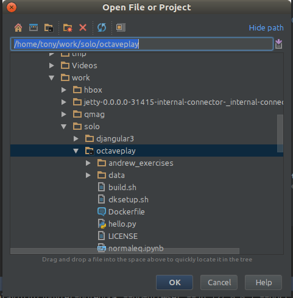
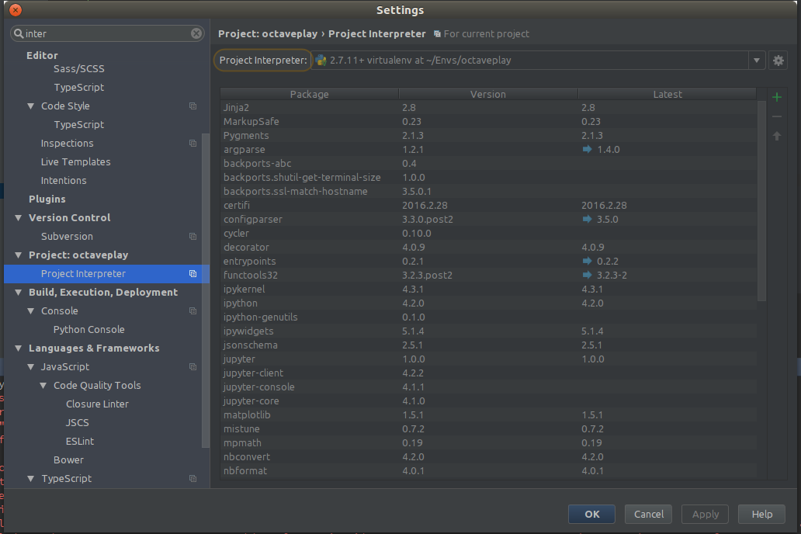
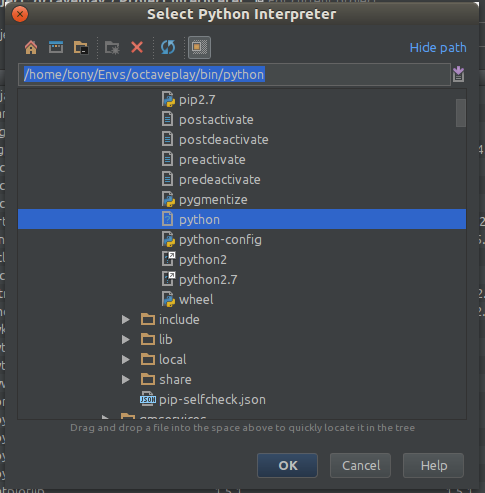

Toy project to play with octave and other things.

# 1. Setup environment

* Install octave

`sudo apt-get install octave`

You only need to do this once in life

* Install virtualenwrapper

You also need to do this only once in a lifetime.
virtualenvwrapper is a convenience tool to work with virtualenvs in python.
Once installed, your bash will have some commands available, like `mkvirtualenv` and `workon`

To install virtualenvwrapper, [follow the installation instructions according to your OS](http://virtualenvwrapper.readthedocs.io/en/latest/install.html)

* Create the octaveplay virtualenv

```
mkvirtualenv octaveplay
```

This creates a virtualenv called octaveplay, and activate it.
You can see that the venv is active by looking at the `(octaveplay)` in your bash prompt.
You can deactivate (== get out of) the virtualenv by typing `deactivate`, and reactivate it with `workon octaveplay`.

* Install this project's python dependencies inside the octaveplay virtualenv

With the virtualenv active, do:

```
pip install -r requirements.txt
```

# 2. Test jupyter-notebook environment

with your virtualenv active, start the jupyter-notebook server

```
jupyter-notebook
```

Then point your browser to http://localhost:8888/.
There. You can browse the \*.ipynb files, like the `normaleq.ipynb` example.

# 3. Test the octave environment.

There's no need to activate the virtualenv for this, since you won't be using python. Just run the normaleq.oct in octave:

```
octave normaleq.oct
```

# 4. (Optional) Setup the environment with Pycharm

[Go get Pycharm](https://www.jetbrains.com/pycharm/download/), the community version is OK.

Once installed, go to File/Open and open the octaveplay folder.



Now you need to tell Pycharm to use the python interpreter from octaveplay virtualenv in this project.

Go to File/Settings and find the `Project interpreter` config screen.



Now click the top-right cog and select "Add local"
Find the `python` executable on your octaveplay virtualenv. Mine is at `/home/tony/Envs/octaveplay/bin/python`



Hit OK and you shoud get a new interpreter option on your Project interpreter dropdown list.
Select that one and your Pycharm will understand that it should use that python executable to run the stuff in your project.


Now you can open and run the \*.ipynb files directly from Pycharm


Install docker and build the image with `./build.sh` (go grab some coffee. This will tak e a while)
Alternatively you can pull from dockerhub:
```
docker pull tonylampada/octaveplay
docker tag tonylampada/octaveplay octaveplay
```
(Coffee should be needed as well)


Run the image with `./run.sh`
Once inside the image, run `source dksetup.sh` (ignore the authentication failure error) - this will allow you to run GUI applications.

Note: You may need to update the uid and gid in dksetup [according to this](http://fabiorehm.com/blog/2014/09/11/running-gui-apps-with-docker/)

# Test oct2py
Start python and test oct2py

```
import oct2py
oc = oct2py.Oct2Py()
x = oc.zeros(3,3)
print(x, x.dtype)

#expect:
#[[ 0.  0.  0.]
# [ 0.  0.  0.]
# [ 0.  0.  0.]] float64
#...
```


# Test octave

Now let's try to predict some function like 3x²/y - 17xy + 8/z + 0w - 13

octave run.oct

# Test graphic environment

Run octave in interactive mode and plot a sin func:

```
t = [0:0.01:1];
y1 = sin(2*pi*4*t);
plot(t, y1)
```
